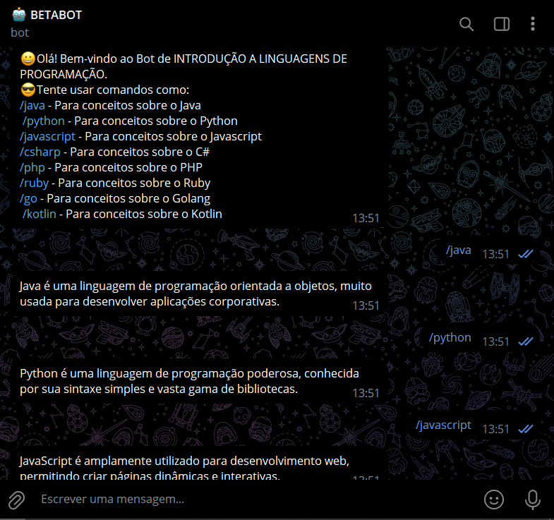

# JAVABOT DE LINGUAGENS
🤤ESTE BOT EN JAVA É IDEAL PARA QUEM DESEJA UMA BREVE INTRODUÇÃO A VÁRIAS LINGUAGENS DE PROGRAMAÇÃO DIRETAMENTE NO TELEGRAM.

 <br>

## DESCRIÇÃO:
Este bot do Telegram foi desenvolvido para fornecer uma introdução a diferentes linguagens de programação, como Java, Python, JavaScript, C#, PHP, Ruby, Go e Kotlin. Ele responde a comandos específicos, enviando descrições breves e concisas sobre cada linguagem. O objetivo principal é fornecer conceitos básicos de cada linguagem, funcionando como uma ferramenta de consulta rápida para iniciantes ou curiosos.

## EXECUTANDO O PROJETO:
1. **Configuração do Bot**:
   No arquivo `Config.java`, você deve inserir o [token](https://t.me/BotFather) do seu bot e o nome de usuário (username) fornecido pela plataforma do Telegram quando você registrou o bot:
   ```java
   public static final String BOT_TOKEN = "TOKEN_DO_BOT_AQUI";
   public static final String BOT_USERNAME = "USER_DO_BOT_AQUI";
   ```

2. **Copilar o Projeto:**
   Antes de executar o projeto, você deve garantir que ele foi compilado corretamente. Navegue até o diretório `./CODIGO`, e use o seguinte comando para compilar:

   ```bash
   mvn clean install
   ```

3. **Executar o projeto:**
   Para executar a aplicação Swing com o Maven, usando a classe principal definida no seu `pom.xml`, use o comando:

   ```bash
   mvn exec:java
   ```

4. **Iniciar a Conversa**:
   - Envie o comando `/start` para receber uma saudação e instruções sobre como utilizar o bot.
   - Resposta esperada:
     ```
     😀 Olá! Bem-vindo ao Bot de INTRODUÇÃO A LINGUAGENS DE PROGRAMAÇÃO.
     😎 Tente usar comandos como:
     /java - Para conceitos sobre o Java
     /python - Para conceitos sobre o Python
     /javascript - Para conceitos sobre o Javascript
     /csharp - Para conceitos sobre o C#
     /php - Para conceitos sobre o PHP
     /ruby - Para conceitos sobre o Ruby
     /go - Para conceitos sobre o Golang
     /kotlin - Para conceitos sobre o Kotlin
     ```

## NÃO SABE?
- Entendemos que para manipular arquivos em muitas linguagens e tecnologias relacionadas, é necessário possuir conhecimento nessas áreas. Para auxiliar nesse aprendizado, oferecemos alguns subsidios:
* [VEJA A DOCUMENTAÇÃO](https://core.telegram.org/bots/api)
* [CURSO SUGERIDO](https://github.com/VILHALVA/CURSO-DE-TELEBOT)
* [CURSO DE JAVA](https://github.com/VILHALVA/CURSO-DE-JAVA)
* [CONFIRA MAIS CURSOS](https://github.com/VILHALVA?tab=repositories&q=+topic:CURSO)

## CREDITOS:
- [PROJETO CRIADO PELO VILHALVA](https://github.com/VILHALVA)

